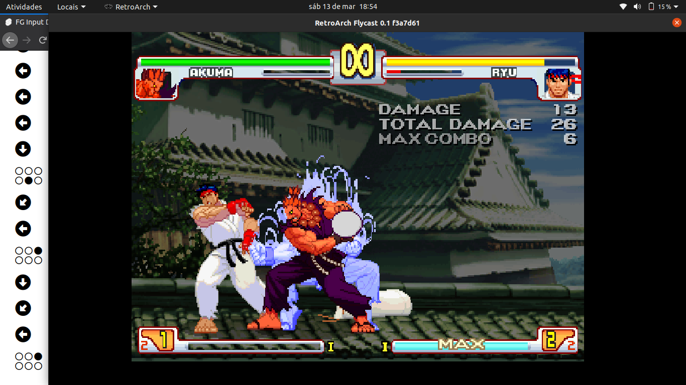
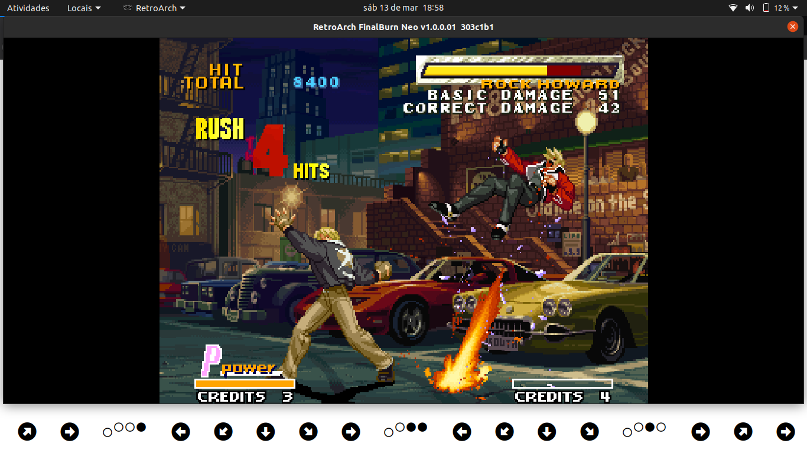

# FG Input Display

A simple [PWA](https://en.wikipedia.org/wiki/Progressive_web_application) to show player input in classic fighting games that doesn't support this function.

## Functions

- Connected gamepads selection
- Button disposition selection (Gamepad, MVS, Six Buttons)
- Remapping
- Select the tolerance for multiple inputs be identified as a single inputs
- Orientation of the inputs display (Vertical or Horizontal)
- Offline support
- Installable on Chrome (Install and use as a native app)

Access on: [fginputdisplay.web.app/](fginputdisplay.web.app/)

